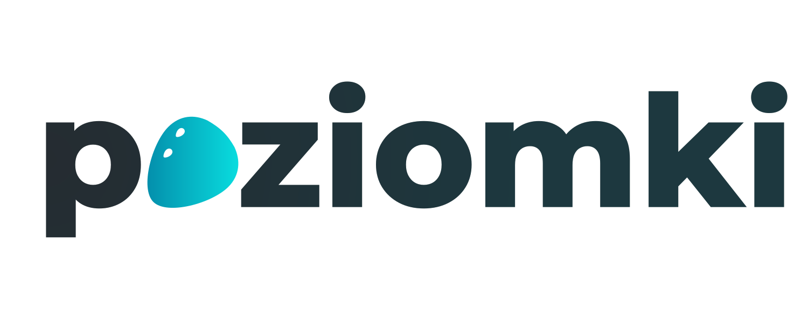
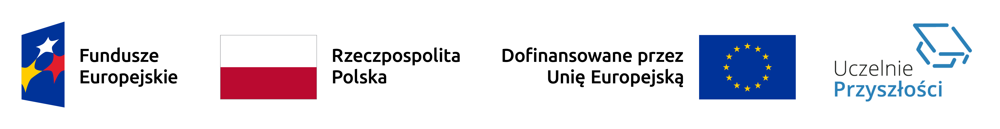

  <picture>
    <source media="(prefers-color-scheme: dark)" srcset="./assets/dark-mode.svg">
    <source media="(prefers-color-scheme: light)" srcset="./assets/light-mode.svg">
    
  </picture>

<b>pl</b> · <a href="./README.en.md">en</a>

aplikacja społecznościowa dla studentów, łącząca według wspólnych zainteresowań i zachęcająca do spędzania więcej czasu razem za pomocą lokalnych wydarzeń

## operacje

dashboard metryk backendu jest dostępny pod `/api/v1/metrics/`, a API JSON pod `/api/v1/metrics`

- ustaw `OPS_STATUS_TOKEN`, aby włączyć oba endpointy
- API JSON oczekuje tokenu w nagłówku `x-ops-token`
- dashboard oczekuje tokenu w parametrze zapytania `token`
- TimescaleDB jest opcjonalne; gdy backend nie może odczytać próbek z bazy, przełącza się na metryki w pamięci i oznacza odpowiedź jako degraded

## licencja

projekt udostępniany jest na warunkach licencji AGPLv3

## finansowanie

  

